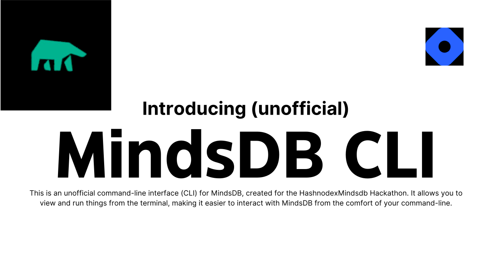

# Unofficial MindsDB Command-line Interface (CLI)



This is an unofficial command-line interface (CLI) for MindsDB, created for the [Hashnode](https://hashnode.com)x[Mindsdb](https://cloud.mindsdb.com) Hackathon. It allows you to view and run things from the terminal, making it easier to interact with MindsDB.

## Requirements

To use this CLI, you will need to have MindsDB installed on your system. You can find installation instructions at the official [MindsDB website](https://cloud.mindsdb.com). 

Additionally, this CLI is written in Python and requires Python 3.6 or higher to be installed on your system.

## Installation

To install the unofficial MindsDB CLI, you can use pip:

```
pip install mindsdb-cli
```

Alternatively, you can clone the repository and install it manually:

```
git clone https://github.com/Arpan-206/mindsdb-cli.git
cd mindsdb-cli
```

## Usage

Once you have installed the CLI, you can start using it right away. This CLI is interactive, meaning that you can view and run things from the terminal. To start the interactive mode, simply type:

```
python -m mindsdb_cli 
```

This will start the interactive shell, where you can run commands and view the results in real-time.


## Contributing

This CLI is an open-source project, and we welcome contributions from anyone who is interested in helping to improve it. If you would like to contribute, please read the [contributing guidelines](https://github.com/Arpan-206/mindsdb-cli/blob/main/CONTRIBUTING.md) and submit a pull request.

## Disclaimer

This is an unofficial CLI interface for MindsDB and is not affiliated with or endorsed by MindsDB. Use at your own risk.

## License

This CLI is licensed under the [MIT License](https://github.com/Arpan-206/mindsdb-cli/blob/main/LICENSE).